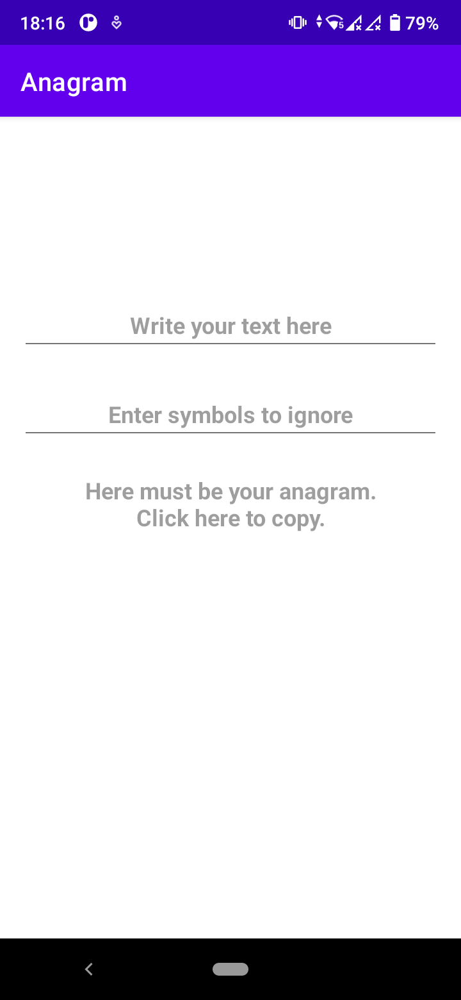
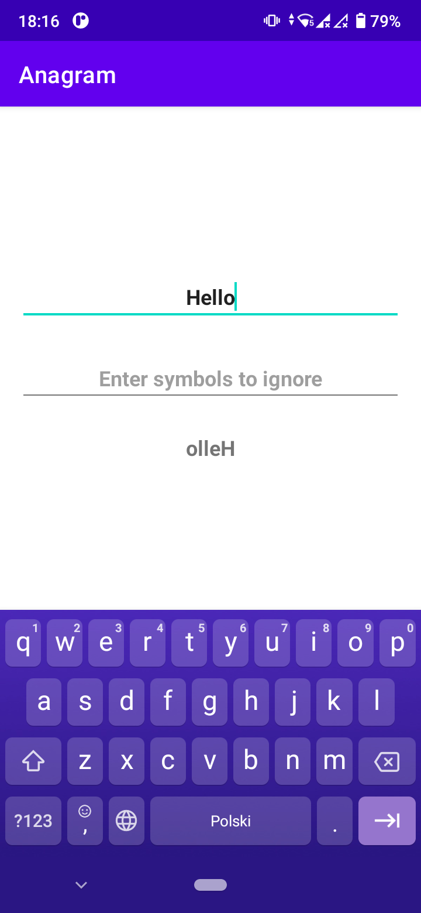
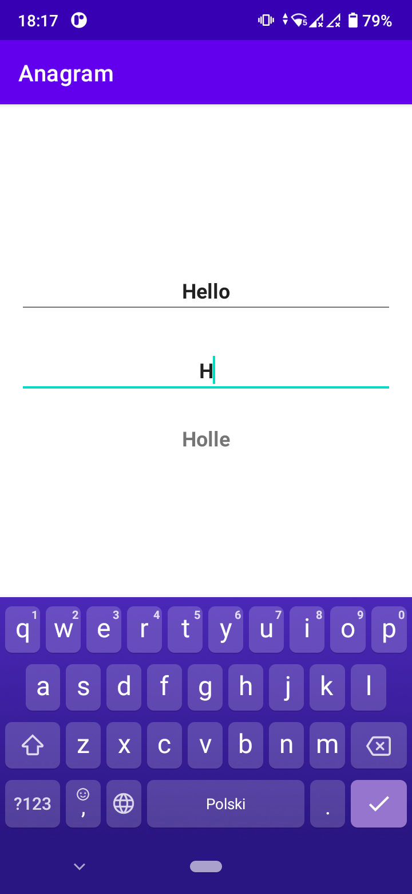
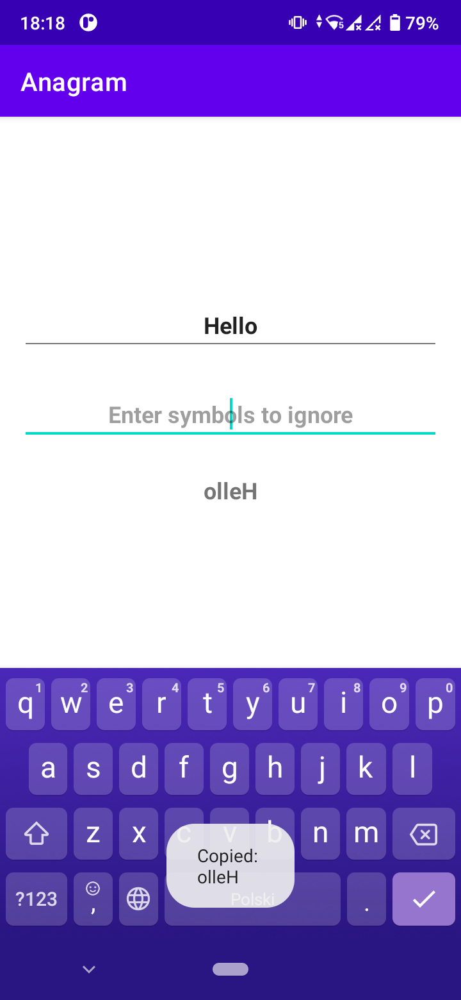

This application reverse every word of entered text in the first field and show result on the screen.
There's the second text field for filtering symbols.
Symbol in word, which is contained in filter, stay on original position.
If text field with filtering symbols is empty, then ignored symbols are digits and non alphabetical symbols.

[Download application](apk/Anagram.apk)

